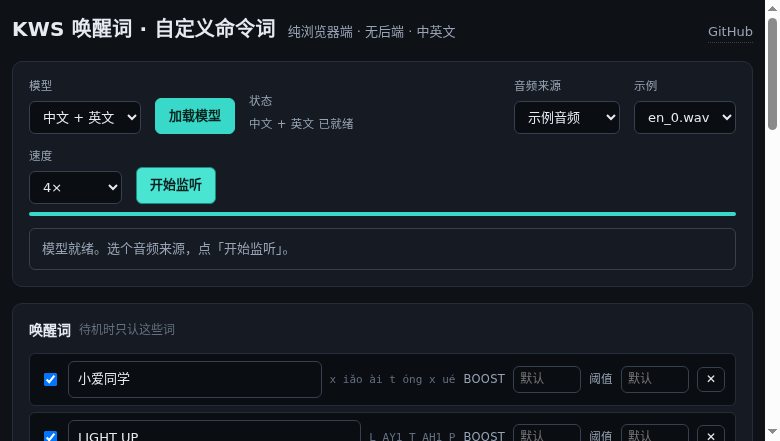
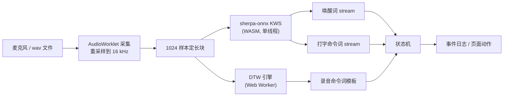

# KWS 唤醒词 · 自定义命令词

纯浏览器端的语音唤醒（Keyword Spotting）与自定义命令词。**没有后端**，所有识别都在你的设备上跑，音频一帧都不上传。

在线试玩：<https://justa-cai.github.io/kws_custom_commands/>



---

## 能做什么

**唤醒词**：说「小爱同学」「LIGHT UP」这类词唤醒。唤醒之前，命令词一律不生效——这样你随手说句话不会误触发。

**自定义命令词，两种造词方式**：

| | 怎么造 | 引擎 | 适合 |
|---|---|---|---|
| 打字造词 | 输入「打开空调」 | sherpa-onnx 开放词汇 | 词好写、要求抗噪 |
| 录音造词 | 现场念 3~5 遍 | MFCC + 子序列 DTW | 方言、口音、生僻说法、外语 |

**语言**：中英混合。同一个词条里可以既有汉字又有英文单词（`打开LIGHT` 也行）。

**音频来源**：麦克风实时，或上传 / 选用示例 wav。

**状态机**：待机 → 唤醒 → 听命令（N 秒）→ 回待机。也可以关掉状态机，让三路并行独立监听。

---

## 它是怎么工作的



### 三个真正难的地方

**1. 中文/英文怎么变成模型认识的音素**

sherpa-onnx 的 `keywords.txt` 要的是「声母 + 带调韵母」序列（`小爱同学` → `x iǎo ài t óng x ué`），英文要 ARPAbet（`LIGHT UP` → `L AY1 T AH1 P`）。官方只有 `sherpa-onnx-cli text2token` 这个 C++/Python 工具，浏览器里拿不到。

所以这个项目**在浏览器里把 text2token 重新实现了一遍**（`src/engines/sherpa/tokenizer/`）：

- 中文走 `pinyin-pro` 取声母韵母，关键的一条规则是**拼音正字法**：`j/q/x/y` 后的 ü 写作 u（军 `j ūn` 而不是 `j ǖn`、学 `x ué` 而不是 `x üé`），`n/l` 后保留 ü（女 `n ǚ`）。少了这条，官方样本只能过 13/16。
- 英文查模型自带的 CMU 发音词典（`en.phone`）。

正确性不靠"我觉得对"：模型自带的 `golden-*.txt` 是上游 `text2token` 生成的，页面上的**「跑一遍分词器自检」**按钮会拿它逐音素比对，直接显示 `10/10`。等于把官方工具当成 oracle 常驻在页面上。

**2. GitHub Pages 上 WASM 起不来**

Pages 不能设 `COOP`/`COEP` 响应头 ⇒ 没有 `SharedArrayBuffer` ⇒ 多线程 WASM 直接崩。

好消息是**上游 sherpa-onnx 的 KWS WASM 构建本来就没有 `-pthread`**（`wasm/kws/CMakeLists.txt`、`build-wasm-simd-kws.sh`、`wasm/common.cmake`、`onnxruntime-wasm-simd.cmake` 全链路都没有）。网上流传的"必须自己删 pthread"是过时信息。所以这里直接编，不需要 `coi-serviceworker` 这类垫片。

**3. 录音造词怎么才不至于乱触发**

模板匹配的坑几乎都在"距离尺度"上（`src/engines/dtw/`）：

- **按段 CMN，不是滚动 CMN**：滚动均值会让同一帧在不同时刻拿到不同的归一化结果，模板和运行时必然对不上。所以归一化放在匹配这一层显式做，且**均值只统计语音帧**——模板是端点检测切出来的、全是语音，而运行时窗口里混着前后静音，不挑出来均值会被静音拉偏。
- **差分免疫**：减去常量再作差分等于没减，所以只有静态倒谱需要归一化。
- **VAD 门控 + 早停 + 30 ms 步长**：不门控的话每 10 ms 要对几十条模板各跑一次 DTW。早停让不匹配的模板在前 5~10 行就被砍掉。
- **阈值自校准**：录完目标词再录一段"别的话"，阈值取「同词模板间最大距离」和「离负样本最小距离」的中点。不录负样本只能拍脑袋，结果不是安静环境误报就是嘈杂环境哑火。

---

## 本地跑起来

需要 Node 22+、Python 3（emsdk 用）、CMake 和 8 GB 左右磁盘。

WASM 不在仓库里（13 MB 的二进制不适合进 git），第一次要先编一次：

```bash
npm install
npm run wasm:build     # 首次约 20-40 分钟：下 emsdk + 编 sherpa-onnx
npm run dev            # http://localhost:5173/kws_custom_commands/
```

之后再改前端代码都不需要重编 wasm。

打开页面后：

1. 点**「加载模型」**（13 MB wasm + 8 MB 模型，会显示进度）
2. 音频来源选**「示例音频」**，速度选「尽快跑完」——不用麦克风也能看到完整效果
3. 点**「开始监听」**

麦克风那一路需要 HTTPS 或 localhost（浏览器安全策略）。

## 部署

仓库已经带了两条 workflow：

- `.github/workflows/build-wasm.yml` —— 手动触发或打 `wasm-v*` 标签。编译结果发布到固定的 `kws-wasm-latest` Release。
- `.github/workflows/deploy-pages.yml` —— push 到 `main` 时构建网页并发布到 Pages，WASM 直接从上面那个 Release 拉。

**第一次部署前必须先手动跑一次 Build WASM**，否则部署任务会明确告诉你缺产物
（Actions 历史里最早那几次红色的 Deploy Pages 就是这个原因，不是配置坏了）。

顺带一提，这也是为什么 wasm 的编译和网页的构建要拆成两条 workflow：编一次
20-40 分钟，跟改几行前端的节奏完全不是一回事。release 产物是固定的标签
`kws-wasm-latest`，每次重编会覆盖它。

## 调参

页面上可以直接调，不用改代码：

- **boost / 阈值**（打字造词）：每个词条单独设。boost 越大越容易触发；阈值越小越容易触发。默认 `1.0` / `0.25`。
- **唤醒窗口**：唤醒后多少秒内认命令词。
- **录音词阈值**：越小越严格。抱怨误触发就调小，抱怨不灵就调大；也可以点「重算阈值」拿现有模板重新校准。

## 项目结构

```
wasm/                    WASM 构建脚本与上游补丁
public/
  worklet/               麦克风采集的 AudioWorklet（放 public 是因为 Vite 的 ?url 对 .ts 不可靠）
  models/                模型权重（zh-en / zh，int8）
  samples/               模型自带 test_wavs，作为回归素材
src/
  audio/                 采集、重采样、文件源、录音器
  engines/sherpa/        sherpa-onnx 封装 + 浏览器版 text2token
  engines/dtw/           MFCC / VAD / 子序列 DTW / Worker
  models/                模型描述符与加载
  selftest/              分词器黄金样本自检
  state/                 状态机、检测会话编排、持久化
  ui/                    原生 DOM 面板
```

## 致谢与许可

本项目代码：**MIT**（见 `LICENSE`）。

仓库里的语音模型、测试音频、黄金样本来自
[k2-fsa/sherpa-onnx](https://github.com/k2-fsa/sherpa-onnx) 的 KWS 预训练模型发布，
**Apache License 2.0**，版权归上游作者所有。逐项清单见 `NOTICE.md`，
各模型目录下的 `README.md` 记录了精确的文件名对照。
